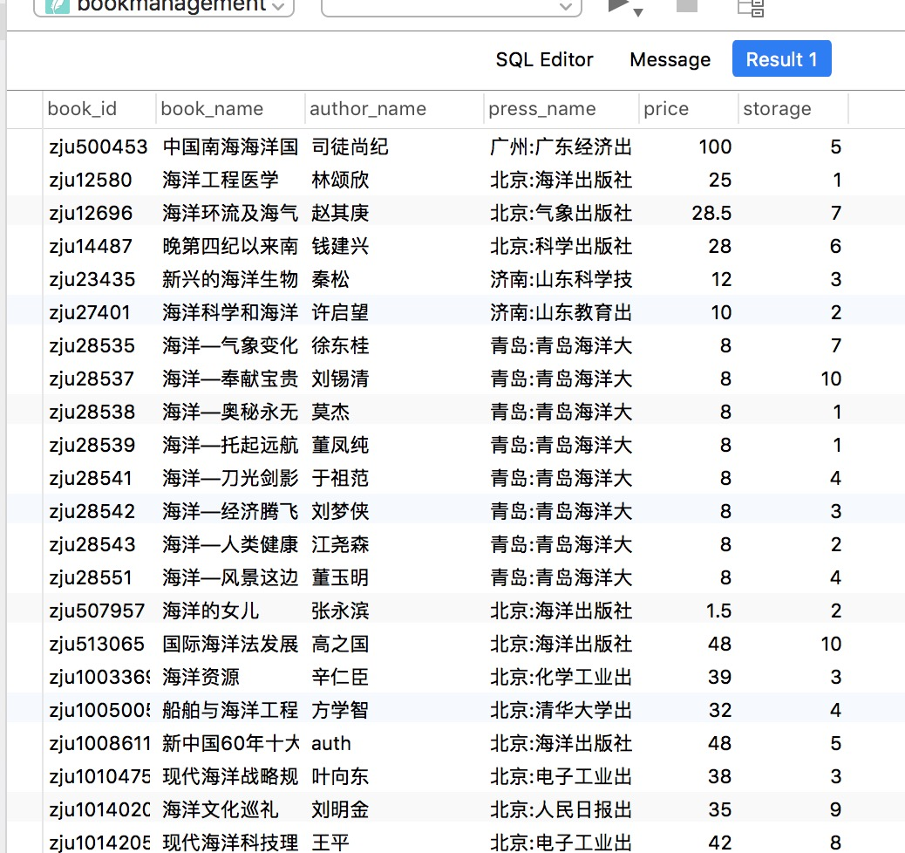
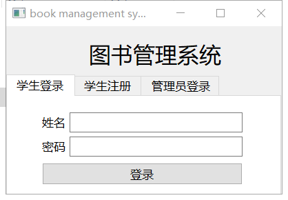
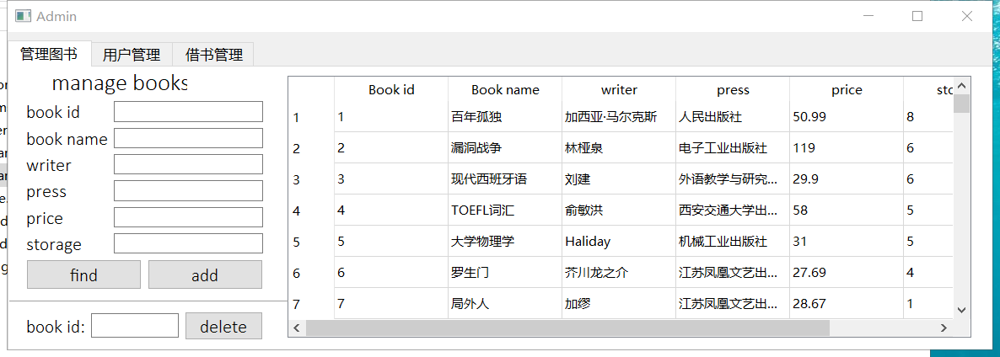

# 软件开发assign6 图书管理系统

## 设计思路

用户设置为两种，分别为学生账户以及管理员账户，学生账户可以进行图书的查询，借/还图书，而管理员用户则可以图书查询，图书管理（包括添加与删除），用户组的设置（用户的查看与删除），借书记录的查看（只看未还与查看全部记录）

预设了管理员账号以及学生账号，**学生账号为`id: 朱凇伯 pw: 111111`, `id: 崔晓筱 pw: 111111`, `id: 莫飞虎 pw: 111111`，以及管理员账号`id: admin pw: 222222`**，同时，学生账号可以在进入的页面注册。

这里涉及到图书的问题，我们本来想的是能否和学校的图书馆系统进行连接，后来果然不行，**只能自己去校图书馆的网页爬取数据**，为了防止影响校内其他同学正常访问，我们特意选取了凌晨一点进行爬取的工作，**然而还是在爬取了2万多条数据后被禁止了ip，不过万这个量级已经足够我们使用了**，具体的爬虫代码我们会贴在最后。

## 数据库实现

根据我们画出的ER图(实在抱歉，到最后ddl了只能手画一个)：


首先来看，我们需要**四个table**

1. student表，用来记录学生账户，需要`name, id, grade, password`四个record，
2. admin表，用于记录管理员信息，需要`name, password`两个record
3. book表，用于记录书的信息，需要`book_id, book_name, author_name, press_name, price, storage`六个record
4. loan表，用于保存借书的信息，需要`loan_id, book_id, book_name, stu_name, borrow_time, return_time`六个记录，需要注意的是，`book_id`是一个foreign key，参考book表的book_id
5. 先行插入student，admin，和一本书的数据
6. **四个表的primary key分别为name, name, book_id, loan_id**‘，建表的sql语句如下：

```sql
create table student(
	name varchar(30) not null primary key,
	id varchar(30) not null,
	grade int,
	password varchar(30) not null
);

insert into student values("朱凇伯", "3160103828", 16, "111111");
insert into student values("崔晓筱", "3160100746", 16, "111111");
insert into student values("莫飞虎", "3160100942", 16, "111111");

create table admin(
	name varchar(30) not null,
	password varchar(30) not null
);

insert into admin values("admin", "222222");

create table book(
	book_id char(5) primary key,
	book_name varchar(30),
	author_name varchar(20),
	press_name varchar(20),
	price float,
	storage int(20)
);

insert into book values("1", "百年孤独", "加西亚·马尔克斯", 人民出版社, 50.99, 4);

create table loan(
	loan_id char(5) primary key,
	book_id char(5),
	book_name varchar(20),
	stu_name varchar(30),
	borrow_time DATETIME(100),
	return_time DATETIME(100),
	foreign key(book_id) references book(book_id)
);
```

## 具体操作实现

**Qt提供了内置的SQLite**，使用如下几条语句进行初始化：

```c++
QSqlDatabase db;
db = QSqlDatabase::addDatabase("QSQLITE");

db.setHostName("127.0.0.1");    //数据库主机名
db.setDatabaseName("bookmanagement");    //数据库名
db.setUserName("root");        //数据库用户名
db.setPassword("qwertyui");        //数据库密码
bool ok=db.open();
```

**之后使用db进行索引，以下是使用的例子：**

```c++
QSqlQuery query(db);
query.exec("select * from book");
```

### 登录

对于登录，我们需要前端与后端（数据库）交互，**从数据库中找到密码，和前端进行校验**，关键代码如下：

```c++
query.exec("select password from student where name = '" + ui->stu_id_text->text() + "';");
query.next();
if (ui->stu_password->text() == query.value(0).toString())
{
    this->hide();
    student *stu_window = new student(db, ui->stu_id_text->text());
    stu_window->show();
    return;
}
```

简单来说，就是先执行`select password from student where name = 'name';`，之后`query.next()`获得结果，和用户输入进行比对，如果相等，则初始化一个student窗口，调用student类`show()`方法

管理员登录同理，这里就不贴代码了

### 图书查询

**为了支持模糊查询，我们使用了sql语句中的`%%`搜索，`%`为sql通配符，和like连用的时候可以替代一个或多个字符**，简而言之，比如我们想根据`book_name`进行索引，我们可以适用语句`select * from book where book_name like '%海洋%';`，这样book_name中含有海洋的记录都会被查询出来，如下(数据库管理软件为Navicat Premium)：



所以这里我们的代码实现：

```c++
sqlString = "select * from book where book_id like '%" + ui->find_bookid->text() + "%' and book_name like '%" +\
            ui->find_bookname->text() + "%' and author_name like '%" + ui->find_writer->text() + "%' and press_name like '%" + \
            ui->find_press->text() + "%';";
```

之后

```c++
while(query.next())
{
    QString book_id = query.value(0).toString();
    QString book_name = query.value(1).toString();
    QString author_name = query.value(2).toString();
    QString press_name = query.value(3).toString();
    float price = query.value(4).toFloat();
    int storage = query.value(5).toInt();
    int rowIndex = ui->tableWidget->rowCount();
    ui->tableWidget->setRowCount(rowIndex+1);
    QTableWidgetItem *item = new QTableWidgetItem (book_id);
    ui->tableWidget->setItem(rowIndex, 0, item);
    item = new QTableWidgetItem (book_name);
    ui->tableWidget->setItem(rowIndex, 1, item);
    item = new QTableWidgetItem (author_name);
    ui->tableWidget->setItem(rowIndex, 2, item);
    item = new QTableWidgetItem (press_name);
    ui->tableWidget->setItem(rowIndex, 3, item);
    item = new QTableWidgetItem (QString("%1").arg(price));
    ui->tableWidget->setItem(rowIndex, 4, item);
    item = new QTableWidgetItem (QString("%1").arg(storage));
    ui->tableWidget->setItem(rowIndex, 5, item);
}
```

将结果输出到tableWidget控件上即可

### 借书/还书

借书还书的过程相当于更新loan表，首先获得loan_id: `QString sqlString = "select max(load_id) from loan;";`，之后要查看该学生是否重复借阅，（查看是否重复只需要查看学生是否借了这本书且return_time是NULL），具体代码：

```
sqlString = "select * from loan where stu_name = '" + student_name + "' and book_id = '" + ui->borrow_bookid->text() + "' and return_time is NULL;";
```

如果有，则报错返回：

```c++
if (query.next())
{
    QMessageBox::warning(this, tr("Already borrowed"),
           tr("You have already borrowed this book! Return first!"),
           QMessageBox::Cancel);
    return;
}
```

之后进行借阅，首先由于用户输入的是`book_id`，我们需要从book表获得book_name，这里可以使用natrual join来连接，但是我代码的实现是两次sql语句，第一次：

```c++
sqlString = "select book_name, storage from book where book_id = '" + ui->borrow_bookid->text() + "';";
QString book_name;
int cur_storage;
query.exec(sqlString);
if (!query.next()){
    QString error = query.lastError().text();
    QByteArray errorx = error.toLatin1();
    QMessageBox::warning(this, tr("Error!"),
           tr("Error! Check first!"),
           QMessageBox::Cancel);
    return;
}

else{
    book_name = query.value(0).toString();
    cur_storage = query.value(1).toInt();
    qDebug() << book_name;
    qDebug() << cur_storage;
}
```

如果发生error，会进入第一个if，这里所有的sql语句执行的时候都会进入报错检查，这段报错代码只在这里贴一次，其余位置不再赘述

于是我们有了book_name，我们还需要检查该书是否还有storage，在上一段代码中，我们从book表中根据book_id索引出了storage，这里加入检查即可，如果检查通过，我们还需要update一下book表中的storage记录，具体代码：

```c++
if(cur_storage <= 0)
{
    QMessageBox::warning(this, tr("No storage!"),
           tr("No storage now! Borrow later!"),
           QMessageBox::Cancel);
    return;
}
cur_storage -= 1;

// second, update the store

sqlString = "update book set storage = " + QString::number(cur_storage) + " where book_id = '" + ui->borrow_bookid->text() + "';";
query.exec(sqlString);
```

最后，我们直接更新loan表即可，Qt提供了时间戳功能，我们可以根据这个获得borrow_time，这里直接贴代码好了：

```c++
QDateTime timestamp = QDateTime::currentDateTime();
timestamp.addDays(1);
QString time = timestamp.toString("yyyy-MM-dd hh:mm:ss");

sqlString = "insert into loan values('" + QString::number(loan_number+1) + "', '" +
        ui->borrow_bookid->text() + "', '" + book_name + "', '" + student_name + "', '" + time + "', NULL);";

query.exec(sqlString);
```

#### 还书

还书我们也要分为两个步骤：更新loan表的return_time以及book表的storage，具体代码：

```c++
QDateTime timestamp = QDateTime::currentDateTime();
timestamp.addDays(1);
QString time = timestamp.toString("yyyy-MM-dd hh:mm:ss");

// first update the loan table
QString sqlString = "update loan set return_time = '" + time + "' where book_id = '" + ui->return_bookid->text() + "' and stu_name = '" + student_name + "' and return_time is NULL;";
qDebug() << sqlString;
QSqlQuery query(database);
query.exec(sqlString);

// then update the storage
sqlString = "update book set storage = (select storage from book where book_id = '" + ui->return_bookid->text() + "') + 1 where book_id = '" + ui->return_bookid->text() + "';";
query.exec(sqlString);
```

学生的功能大概就这么多，之后介绍管理员功能的代码实现：

首先管理员使用账号：admin，密码：222222即可登录

### 图书管理

图书管理中的查询功能在之前已经介绍过，而对于图书的增加功能，只需要一个insert语句，代码：

```c++
QString sqlString;
sqlString = "insert into book values('" + ui->find_bookid->text() + "', '" + ui->find_bookname->text() + "', '" + ui->find_writer->text() + "', '" \
        + ui->find_press->text() + "', " + ui->find_price->text() + ", " + ui->find_storage->text() + ");";
QSqlQuery query(database);
query.exec(sqlString);
```

至于图书的删除，只需要一个book id即可实现一个delete的sql语句，具体代码：

```c++
QString sqlString;
sqlString = "delete from book where book_id = '" + ui->delete_book_id->text() + "';";
QSqlQuery query(database);
query.exec(sqlString);
```

### 用户管理

首先是展示用户，用一个表格体现出来，同样的，也是一个select语句，从student表读取即可，这里的代码：

```c++
QString sqlString;
sqlString = "select * from student";
query.exec(sqlString);
ui->student_table->clearContents();
ui->student_table->setRowCount(0);
while(query.next())
{
    QString stu_name = query.value(0).toString();
    QString stu_id = query.value(1).toString();
    int stu_grade = query.value(2).toInt();
    QString password = query.value(3).toString();

    int rowIndex = ui->student_table->rowCount();
    ui->student_table->setRowCount(rowIndex+1);
    QTableWidgetItem *item = new QTableWidgetItem (stu_name);
    ui->student_table->setItem(rowIndex, 0, item);
    item = new QTableWidgetItem (stu_id);
    ui->student_table->setItem(rowIndex, 1, item);
    item = new QTableWidgetItem (QString("%1").arg(stu_grade));
    ui->student_table->setItem(rowIndex, 2, item);
    item = new QTableWidgetItem (password);
    ui->student_table->setItem(rowIndex, 3, item);
}
```

同样的，还可以进行用户的删除，需要注意的是，考虑到数据库的完整性，根据数据库的ER模型，在删除学生的时候，应该把与之关联的loan信息进行更新，即删除所有该学生的借书记录，具体代码：

```c++
// first delete from student table
sqlString = "delete from student where name = '" + ui->delete_stu_name->text() + "';";
query.exec(sqlString);

// first delete from student table
sqlString = "delete from student where name = '" + ui->delete_stu_name->text() + "';";
query.exec(sqlString);
```

### 借书管理

对于管理员用户，理应能看到每个用户的借书情况，这里我将借书记录分成了已还的和未还的，区分标准就在于`return_time`是否为NULL，这个表展示了`loan_id, book_id, book_name, storage, price, stu_name, borrow_time, return_time`，需要联合book和loan两个表，具体代码（unreturn由控件上的一个checkBox控件决定）：

```c++
void manager::update_loan_list(int unreturn)
{
    QString sqlString;
    QSqlQuery query(database);
    if (unreturn)
    {
        sqlString = "select * from loan natural join book where return_time is NULL;";
    }
    else{
        sqlString = "select * from loan natural join book;";
    }
    ...
}
```

之后和前面的一样，将信息呈现在控件上即可，代码：

```c++
ui->loan_table->clearContents();
ui->loan_table->setRowCount(0);
while(query.next())
{
    QString loan_id = query.value(0).toString();
    QString book_id = query.value(1).toString();
    QString book_name = query.value(2).toString();
    int storage = query.value(9).toInt();
    float price = query.value(8).toFloat();
    QString stu_name = query.value(3).toString();
    QString borrow_time = query.value(4).toString();
    QString return_time = query.value(5).toString();

    int rowIndex = ui->loan_table->rowCount();
    ui->loan_table->setRowCount(rowIndex+1);
    QTableWidgetItem *item = new QTableWidgetItem (loan_id);
    ui->loan_table->setItem(rowIndex, 0, item);
    item = new QTableWidgetItem (book_id);
    ui->loan_table->setItem(rowIndex, 1, item);
    item = new QTableWidgetItem (book_name);
    ui->loan_table->setItem(rowIndex, 2, item);
    item = new QTableWidgetItem (QString("%1").arg(storage));
    ui->loan_table->setItem(rowIndex, 3, item);
    item = new QTableWidgetItem (QString("%1").arg(price));
    ui->loan_table->setItem(rowIndex, 4, item);
    item = new QTableWidgetItem (stu_name);
    ui->loan_table->setItem(rowIndex, 5, item);
    item = new QTableWidgetItem (borrow_time);
    ui->loan_table->setItem(rowIndex, 6, item);
    item = new QTableWidgetItem (return_time);
    ui->loan_table->setItem(rowIndex, 7, item);
}
```

### 图书信息爬虫

图书信息的主要就是用来测试这个图书管理系统的性能的。我们选择了从学校的图书馆的中文文献库图书信息检索页面获取数据。分析url链接之后能够确定全库大约有一百三十多万份书籍的信息，不同的书拥有不同的request码，从1开始增大。这样我们只需要针对每一本书向服务器发出一个请求，就能够很方便的遍历这些书本的信息了。具体代码如下：

##### 调用的库

```python
import requests
from bs4 import BeautifulSoup
import re
import csv
import random
id = 0
```

##### 页面抓取函数

```python
def getHTMLText(url):
    global id
    try:
        r = requests.get(url)
        r.raise_for_status()
        r.encoding = r.apparent_encoding
        return r.text
    except:
        print("Network ERROR")
        return ""
    return ""
```

##### 网页文本解析及信息提取

```python
def file_gen(url, amt):
    global id
    id = amt*5000
    amount = id+5000 
    all_info = []
    while id < amount:
        id+=1;
        try:
            html = getHTMLText(url+str(id))
            if html == "":
                continue
            soup = BeautifulSoup(html, "html.parser")
            info = ["name", "press", "auth", "price", 0, id]
            q = []
            for item in list(soup.find(string = re.compile('content_item_list_table')).parent)[1].find_all('tr'):
                q.append(item)
            for tag in q:
                if len(tag) == 5:
                    my_str = str(tag.contents[1].string)
                else: continue
                if my_str.find("ISBN") != -1:
                    if str(tag.contents[3].a.string).find("CNY") == -1:
                        continue
                    else:
                        l = str(tag.contents[3].a.string).split("CNY")
                        a = re.findall(r"\d+\.?\d*",l[-1])
                        if a:
                            info[3] = float(a[0])
                            info[4] = info[4] + 1
                elif my_str.find("个人著者") != -1:
                    info[2] = "".join(str(tag.contents[3].a.string).split())
                    info[4] = info[4] + 1
                elif my_str.find("出版发行") != -1:
                    info[1] = "".join(str(tag.contents[3].a.string).split())
                    info[4] = info[4] + 1
                elif my_str.find("题名") != -1:
                    a = "".join(str(tag.contents[3].a.string).split())
                    if a.find('/') != -1:
                        a = a.split('/')[0]
                    info[0] = a;
                    info[4] = info[4] + 1
        except:
            print("Analyze ERROR\n")
        if info[4] == 4:
            if id % 50 == 0:
                print(info)
            all_info.append([i for i in info])
    
    with open("info"+str(amt)+".csv","w") as f:
        mywriter=csv.writer(f)
        for item in all_info:
            try:
                mywriter.writerow(item)
            except:
                print("Encoding ERROR")
    with open("sql"+str(amt)+".txt", "w") as f:
        for item in all_info:
            try:
                f.write("insert into book values('zju"+str(item[-1])+"', '"+item[0]+"', '"+item[2]+"', '"+item[1]+"', "+str(item[3])+", "+str(random.randint(1,10))+");\n")
            except:
                print("Encoding ERROR")
```

##### 主函数

```python
def main():
    seed = "http://webpac.zju.edu.cn/F/V9J78NRIC61BRJFBY6LTLQYC9787SJATLT4GVJTD2SL73S9CK5-53761?func=find-b&find_code=SYS&local_base=ZJU01&request="
    i = int(input("i = "))
    while i < 260:
        file_gen(seed, i)
        i+=1

main()
```

## 效果图

用户注册：



注册成功：


图书查询（根据book name查询）：


图书查询（根据press查询）：


图书查询（根据writer查询）：


图书借阅（在还书list会进行更新）：


图书归还（会更新return time）：


管理员窗口：



管理员添加图书：


管理员删除图书：


管理员删除用户：


管理员查看所有借书记录：


管理员查看所有未还记录：

